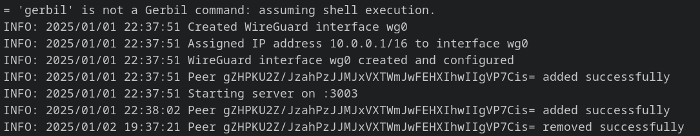

# Gerbil

Gerbil is a simple WireGuard interface management server written in Go. Gerbil makes it easy to create Wireguard interfaces as well as add and remove peers with an HTTP.

### Installation and Documentation

Gerbil can be used stand alone with your own API, a static JSON file, or with Pangolin and Newt as part of the larger system. See documentation below:

-   [Installation Instructions](https://docs.fossorial.io)
-   [Full Documentation](https://docs.fossorial.io)

## Preview



_Sample output of a Gerbil container connected to Pangolin and terminating various peers._

## Key Functions

### Setup Wireguard

A Wireguard interface will be created and configured on the local Linux machine or in the Docker container according to the values given in either a JSON config file or via the remote server. If the interface already exists it will be reconfigured.

### Manage Peers

Gerbil will create the peers defined in the config on the Wireguard interface. The HTTP API can be used to remove, create, and update peers on the interface dynamically.

### Report Bandwidth

Bytes transmitted in and out of each peer is collected every 10 seconds and incremental usage is reported via the "reportBandwidthTo" endpoint. This can be used to track data usage of each peer on the remote server.

## CLI Args

`reachableAt`: How should the remote server reach Gerbil's API?
`generateAndSaveKeyTo`: Where to save the generated Wireguard private key to persist across restarts.
`remoteConfig` (optional): Remote config location to HTTP get the JSON based config from. See `example_config.json`
`config` (optional): Local JSON file path to load config. Used if remote config is not supplied. See `example_config.json`

Note: You must use either `config` or `remoteConfig` to configure Wireguard.

`reportBandwidthTo` (optional): Remote HTTP endpoint to send peer bandwidth data
`interface` (optional): Name of the Wireguard interface created by Gerbil. Default: `wg0`
`listen` (optional): Port to listen on for HTTP server. Default: `3003`
`log-level` (optional): The log level to use. Default: INFO

Example:

```bash
./gerbil \
--reachableAt=http://gerbil:3003 \
--generateAndSaveKeyTo=/var/config/key \
--remoteConfig=http://pangolin:3001/api/v1/gerbil/get-config \
--reportBandwidthTo=http://pangolin:3001/api/v1/gerbil/receive-bandwidth \
```

Note: CLI args can be passed as "command" fields when using the Docker container.

## Build

### Container 

Ensure Docker is installed.

```bash
make
```

### Binary

Make sure to have Go 1.23.1 installed.

```bash
make local
```

## Licensing

Gerbil is released under the ... license. For inquiries about commercial licensing, please contact us.

## Contributions

Please see [CONTRIBUTIONS](./CONTRIBUTIONS.md) in the repository for guidelines and best practices.